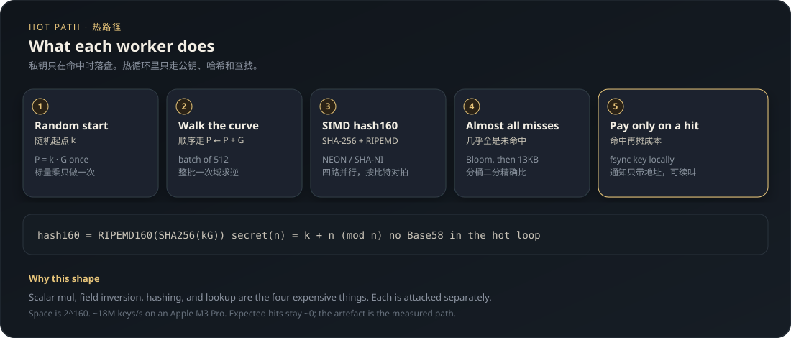
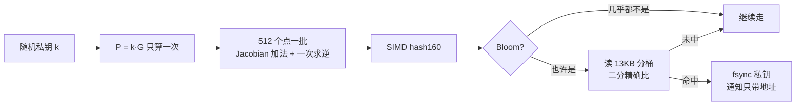

<p align="center">
  
</p>

<p align="center">
  <a href="README.md">English</a> · <strong>中文</strong>
</p>

<h1 align="center">Plutus-Rustus</h1>

<p align="center">
  比特币密钥空间上的高性能扫描实验<br>
  一份用基准数字说话的性能工程作品
</p>

<p align="center">
  <a href="https://github.com/a137x/plutus-rustus/stargazers"></a>
  
  
  
  
</p>

---

这是我拿来练手的项目。它**没有可兑现的产品功能**，期望收益约等于零。我把它开源出来，是因为它把几件真正难的系统问题做到了能用数字验收的程度：椭圆曲线热路径、SIMD 哈希、小内存下的千万级查找、以及一套能装上 VPS 自己跑的发布链路。

> **先把预期放在桌上。** 比特币地址空间是 2<sup>160</sup>。当前快照里大约四千四百万个有余额的 P2PKH / P2WPKH。Apple M3 Pro 全核约 **1800 万钥匙 / 秒**，期望撞上一次仍是宇宙时间尺度。所以这个仓库证明的不是「我会挖比特币」，而是「我能把一条热循环从 28 万/秒推到 285 万/秒，并且每一步都有对照实验」。

**目录**

- [它在做什么](#它在做什么)
- [一张图看懂热路径](#一张图看懂热路径)
- [原理](#原理)
- [优化是怎么验出来的](#优化是怎么验出来的)
- [内存为什么只有几十 MB](#内存为什么只有几十-mb)
- [命中之后：落盘，再反复叫人](#命中之后落盘再反复叫人)
- [安全边界](#安全边界)
- [跑起来](#跑起来)
- [我希望别人从这份作品里看到什么](#我希望别人从这份作品里看到什么)

## 它在做什么

程序持续做四件事：

1. 在 secp256k1 上走一段连续的私钥区间
2. 把每个公钥压成 20 字节的 `hash160`
3. 去一份离线的「有余额地址」快照里查
4. 查中了，就把私钥写到本地，并推一条**不含私钥**的通知

打包后的进程名是 `goldpan`：像淘金槽一样，让大量候选从格子里流过，只把极少数（实际上几乎不会出现的）亮点留下来。

它从 [Plutus](https://github.com/Isaacdelly/Plutus) 移植而来，后来按 [mattsta/Plutus](https://github.com/mattsta/Plutus) 同一套思路重写了热路径：顺序走曲线、Montgomery 批量求逆、SIMD `hash160`。对照实验写在下面。

## 一张图看懂热路径

<p align="center">
  
</p>



热循环里**不做** Base58、**不算**完整地址字符串、**不碰**网络。网络只出现在：启动、心跳、更新快照、命中告警。

## 原理

### 1. 从私钥到「能不能花这笔钱」

比特币里，一把私钥是 `[1, n)` 上的一个整数，`n` 是 secp256k1 的群阶。对应公钥是椭圆曲线点 `P = k · G`。人们日常看到的 `1...` / `bc1q...` 地址，核心都是：

```text
hash160 = RIPEMD-160(SHA-256(公钥字节))
```

20 字节。有余额的地址离线快照，也被解成这 20 字节再入库。所以热循环的查找键就是 `hash160`，不是 Base58 字符串。

同一把压缩公钥的 `hash160`，既可以编码成 P2PKH（`1...`），也可以编码成 P2WPKH（`bc1q...`）。这份快照两种都收。P2SH、P2WSH、Taproot（`bc1p...`）对不上这个哈希，加载时直接丢掉。

### 2. 为什么顺序走，而不是每把钥匙都做标量乘

标量乘法 `k · G` 很贵。但如果你已经有 `P = k · G`，下一把钥匙的公钥就是：

```text
(k + 1) · G  =  P + G
```

一次点加，比再做一次标量乘便宜一个数量级以上。所以每个工作线程只**随机抽一次**起点，然后沿着曲线连续走 `walk_span`（默认 2<sup>30</sup>）步。秘密可以事后还原：

```text
secret(offset) = start + offset   (mod n)
```

随机起点保证线程之间不撞车；顺序走保证热路径里再也看不到 `scalar_mul`。

### 3. 真正的大头：域求逆，以及如何把它摊掉

顺序走之后，单步仍然要把 Jacobian 坐标变回仿射，才能拿去哈希。一次域求逆大约吃掉整圈 **80%** 的时间。

做法是：先在 Jacobian 里把 512 个点加完（只要乘法和加法），再用 Montgomery 的批量求逆，**整批共用一次逆**。这段跑在 [libsecp256k1](https://github.com/bitcoin-core/secp256k1) `v0.2.0` 的域算术上，由 `csrc/shim.c` 薄薄包一层。

我先试过纯 Rust 的 `k256` 批量求逆，单线程输给 libsecp256k1 的逐点 `combine`（29 万 vs 48 万）。批量求逆要赢，底下的域乘法必须够快——所以赢的是「在 libsecp256k1 上面做批量」，不是换一条曲线库。

相对逐点 `combine`，椭圆曲线这一步大约快 **7 倍**。正确性用 `cargo test` 按比特对拍。

### 4. 第二贵的是哈希：SIMD `hash160`

`hash160 = RIPEMD-160(SHA-256(pubkey))`。压缩公钥 33 字节、一块 SHA-256；未压缩 65 字节、两块。

| 平台 | SHA-256 | RIPEMD-160 |
|---|---|---|
| aarch64 | ARMv8 SHA 指令 | 4 路 NEON（`csrc/hash_neon.c`） |
| x86_64 | SHA-NI | 4 路 SSE2（`csrc/hash_x86.c`） |
| 其他 / 无 SHA-NI | `sha2` / `ripemd` crate | 同上 |

两条 SIMD 路径都和 crate 参考实现按比特对齐。未压缩 P2PKH 默认打开，吞吐大概再掉 10–15%；只想看压缩地址的峰值，把 `check_uncompressed` 关掉即可。

### 5. 查找：几乎每一次都是 miss

四千四百万个 20 字节，整表进内存大约 880 MB。但这条热路径的命中率低到可以当成永远不中。所以默认不把表放进 RAM：

```text
hash160
  └─ Bloom（14–18 bit/key，允许假阳，不允许假阴）
        ├─ 否：直接走下一把   ← 几乎都走这里
        └─ 也许：按前两个字节进 65536 个桶之一
                 pread 大约 13KB，桶内二分，精确比较
```

Bloom 假阳只会让你多读一次磁盘，不会漏掉真命中。假阴才是正确性 bug，有测试盯着。

`low` / `balanced` / `full` 只调 Bloom 的密度和线程，不改这条形状。`lookup = "sorted"` / `"hash"` 留给对照实验。

## 优化是怎么验出来的

同一份 `JUL_12_2026` 快照（44,365,067 个地址），Apple M3 Pro（5 性能核 + 6 能效核）：

| 版本 | 单线程 | 5 个性能核 | 11 核全开 |
|---|---:|---:|---:|
| 顺序 `combine` + crate `hash160` | ~28 万/秒 | — | ~315 万/秒 |
| \+ 批量求逆 | ~148 万/秒 | ~675 万/秒 | ~1050 万/秒 |
| **\+ SIMD `hash160`** | **~285 万/秒** | **~1280 万/秒** | **~1820 万/秒** |

单线程大约 **10 倍**，全核大约 **5.8 倍**。性能核单核约 256 万/秒，和 mattsta 的 C 加速器同一量级。11 核总数被能效核拖着（大约是性能核的三分之一）；只想看峰值就 `PLUTUS_THREADS=5`。

判断优劣的方式从来不是「感觉更快了」，而是同一份数据、同一台机器、对照关开每一档优化。

## 内存为什么只有几十 MB

| 档位 | 适用 | 地址表大约占内存 |
|---|---|---|
| `low` | 1 核小 VPS | ~75 MB |
| `balanced` | 普通云主机 | ~85 MB |
| `full` | 空闲工作站 | ~100 MB |

进程 RSS 会再高一点。刷新快照时先丢掉表再下载，峰值大约 150–200 MB。**256 MB 能跑 `low`，512 MB 舒服，1 GB 很宽裕。** 表的内存不随线程数涨。

第一次启动如果只有 pickle 切片，会迁到 `data/addresses.h160`；之后大约一秒加载。20 字节记录留在磁盘上。

## 命中之后：落盘，再反复叫人

真命中的概率可以当成零。但一旦发生，漏掉一条手机横幅就是不可接受的。所以告警被拆成两层：

| 层 | 写什么 | 目的 |
|---|---|---|
| `findings/hits.txt` | 私钥、WIF、公钥、地址，`fsync` | 数据不能丢 |
| Bark / Webhook / Server 酱 | **只有地址** | 把人叫醒 |

推一次不够。默认每 **120 秒**再推一次，**一直叫到你 `ack`**。进程重启、快照刷新都会接着叫，因为待推队列落在 `data/pending-hits.json` 里，里面同样没有私钥。

看过之后停掉续叫：

```bash
~/plutus-rustus/bin/goldpan ack
# 或
plutus-rustus ack
```

`ack` 不动 `findings/`。想改节奏：

```toml
[notify]
hit_repeat_secs = 120   # 0 = 只推一次
hit_repeat_max = 0      # 0 = 一直叫到 ack（默认）
```

第一次按「时效通知」发；后面几次会升到 Bark 的 critical。心跳、启动、停机仍是普通优先级，避免和命中抢同一组。

## 安全边界

- 私钥只出现在本地 `findings/hits.txt`。通知、日志、`status.json`、待推队列都不带秘密。
- Bark 密钥走环境变量，不进 argv（`ps` 看得到命令行）。
- 这个程序**不能**替你转账、不能签名、不接触热钱包。
- 它也不是「恢复钱包」工具。把随机扫描理解成一种合法的密码学彩票即可——彩票的期望是零。

## 跑起来

预编译安装，只要 curl 和 tar：

```bash
curl -fsSL https://raw.githubusercontent.com/toolazytoname/plutus-rustus/main/install.sh | bash -s --
```

默认 `low`（约 75 MB）。更强的机器：

```bash
curl -fsSL https://raw.githubusercontent.com/toolazytoname/plutus-rustus/main/install.sh | bash -s -- --profile=full
```

```bash
~/plutus-rustus/bin/goldpan            # 等价于 goldpan run
~/plutus-rustus/bin/goldpan doctor
~/plutus-rustus/bin/goldpan notify-test
~/plutus-rustus/shell/plutus status
```

从源码编需要 Rust 1.85（`rust-toolchain.toml` 钉死，和 CI clippy 一致）、一个 C 编译器，以及 `depend/secp256k1` 子模块。aarch64 会自动编进 NEON `hash160`。

更完整的参数、systemd、Bark 配置见 [docs/DEPLOY.md](docs/DEPLOY.md)。

现场输出大概是这样：

```text
Loaded 44358226 unique funded hash160s (P2PKH + P2WPKH) in 11.31s from data/addresses.h160 via mmap (~75MB RAM, 0 skipped)
Running on 11 worker thread(s) | uncompressed=true | simd=neon | cpu=100 | lookup=mmap | walk_span=1073741824
still running | checked 56623104 keys | 18822277 keys/s avg | hits 0
```

`data/status.json` 每 3 秒覆写一次。进程日志只记启动、每小时汇总、刷新快照、命中、出错和停止。

## 我希望别人从这份作品里看到什么

| 我实际做的 | 对应的工程能力 |
|---|---|
| 先写对照，再改热路径 | 用基准收敛，不用感觉收敛 |
| 纯 Rust 批量求逆输了，就改到 libsecp256k1 上再批 | 会为数字换方案，不为洁癖死守 |
| SIMD 和参考实现按比特对拍 | 加速和正确性拆开验收 |
| Bloom + 磁盘分桶，而不是把 880 MB 表塞进内存 | 按 miss 率选数据结构 |
| `low` 能在 256 MB VPS 上住下 | 性能数字之外，还在意真实机器 |
| `install.sh`、musl 静态链接、systemd、Bark | 能发布，不只是能 `cargo run` |

如果你只看一句：这是一个把「椭圆曲线 + 哈希 + 大规模只读查找」做到可测量、可回退、可部署的练习。密钥空间的期望收益是零；练习本身不是。

MIT License。问题和想法走 [Issues](https://github.com/a137x/plutus-rustus/issues)。
