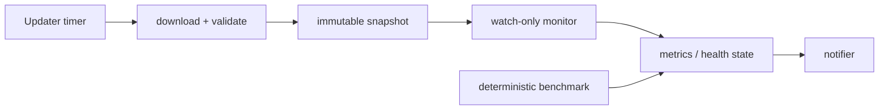

# Plutus-Rustus Revival Plan

## Purpose and boundary

This branch restores the project as a reproducible cryptographic research and
watch-only monitoring tool. It must not automate the use, transfer, or
exfiltration of private keys. Notifications and logs must never contain private
key material.

The implementation baseline is `upstream/master` at `d7caeb3`; the former local
implementation remains available on `master` for reference.

## Decisions already made

- Work only on `codex/revive-plutus`, based on the current upstream engine.
- Keep the upstream performance work isolated from the data/update/control
  plane so every component is independently testable.
- Treat address data as a versioned local artifact, not as a source-controlled
  repository asset.
- Use a configurable public data source and only activate a new snapshot after
  integrity checks complete.
- Provide watch-only status reports for a user-supplied address list. A
  cryptographic benchmark uses deterministic test vectors only.
- Keep all notifier credentials in environment variables or a local ignored
  config file; never write them to source, logs, CI output, or tests.

## Target architecture



### Modules

The end state is a library plus a thin CLI, rather than one long `main.rs`:

```text
src/
  lib.rs
  main.rs                    # clap subcommands
  config.rs                  # config + environment validation
  snapshot/
    mod.rs
    format.rs                # versioned manifest and fixed-width records
    import.rs                # stream/validate external dumps
    store.rs                 # activate/retain/inspect snapshots
  watch/
    mod.rs                   # user-owned address list monitor
    status.rs                # counters and periodic health reports
  notify/
    mod.rs
    webhook.rs               # generic HTTP webhook
    serverchan.rs            # optional ServerChan adapter
  benchmark/
    mod.rs                   # deterministic test-vector benchmark only
tests/
  fixtures/
deploy/
  plutus.service
  plutus-update.service
  plutus-update.timer
```

## Data snapshot contract

The updater will consume a configurable TSV/GZip source. It will only accept a
complete input and will not replace the existing usable snapshot on error.

```text
data/                         # ignored by Git
  current.json                # small atomically replaced pointer/manifest
  snapshots/<snapshot-id>/
    manifest.json
    addresses.h160            # sorted, deduplicated [u8; 20] records
    source.sha256
  partial/                    # transient and cleaned on next update
```

`manifest.json` must include the source URL, ETag or Last-Modified value,
download timestamp, SHA-256, schema version, record count, supported address
type counts, and the source data date if available.

Import rules:

- Reject malformed rows and record their count; fail if the error rate exceeds
  a configured threshold.
- Preserve only non-zero-balance records appropriate to the selected research
  mode.
- Decode/normalise the address once during import. Runtime comparisons use raw
  fixed-width bytes, never user-facing Base58 strings in a hot path.
- Sort and deduplicate before writing `addresses.h160`.
- Build in `partial/`, checksum the completed files, fsync, then activate by
  atomically replacing `current.json`.
- Keep the active snapshot plus one known-good predecessor. Cleanup must never
  remove the snapshot referenced by `current.json`.

The default schedule is one metadata check per day. Download only when ETag or
Last-Modified changes; make interval, source URL, retention count, and maximum
snapshot age configurable.

## Runtime design

### Watch-only monitor

`plutus watch` reads `watchlist.txt` (one address per line), validates it,
checks it against the active snapshot, and writes no secret data. It provides:

- start, update-success/update-failure, and shutdown events;
- configurable heartbeat reports (default six hours);
- total watchlist count, funded count, snapshot ID/date, snapshot age, run
  time, last successful update, and notifier health;
- a change event only when a watched address changes membership between two
  snapshots.

### Status and notification

Workers update local counters and merge them into atomics in batches. A single
reporter task reads those atomics at an interval. The hot path must never make
network requests or open files.

Notification providers implement one trait and are selected by configuration.
The first providers are a generic webhook and ServerChan. Every request uses a
reused client, a timeout, bounded retry/backoff, and a redacted error log.

Event payloads contain only safe metadata. A payload may include a watched
address if the owner enables it, but it must never include WIFs, raw secret
keys, access tokens, host public IP addresses, or full environment values.

### Benchmark

Keep performance evaluation separate from production monitoring:

- use known deterministic test vectors and a synthetic fixture;
- report operations/second, CPU/thread count, build target, and data size;
- do not query public balance services while benchmarking;
- require bit-for-bit reference tests before accepting a faster code path;
- record benchmark baselines per hardware target rather than making
cross-machine claims.

## Integration strategy

The five upstream commits after the common ancestor add a substantial engine,
a native C shim, an initialized `secp256k1` submodule, and a large database
snapshot. They are already the branch baseline, so do not merge local `master`
back wholesale.

1. Stabilise the upstream baseline: initialise the submodule, format, compile,
   and run deterministic upstream tests.
2. Delete the old one-file application responsibilities only after their
   replacements have tests.
3. Move generated datasets and findings out of version control in a normal
   commit. Do not rewrite shared history during this recovery project.
4. Reintroduce only the useful local behavior: periodic status, configuration,
   deployment, and CI. Do not restore hard-coded credentials or data-hosting
   scripts.

## Configuration contract

Ship `config.example.toml`; local `config.toml` stays ignored.

```toml
[data]
directory = "./data"
source_url = "https://example.invalid/addresses.tsv.gz"
check_interval_hours = 24
max_snapshot_age_hours = 30
retain_snapshots = 2

[watch]
watchlist = "./watchlist.txt"
heartbeat_minutes = 360

[notify]
provider = "webhook"       # webhook | serverchan | disabled
token_env = "PLUTUS_NOTIFY_TOKEN"
webhook_url_env = "PLUTUS_WEBHOOK_URL"
```

CLI commands:

```text
plutus doctor
plutus data update [--source-url URL]
plutus data inspect
plutus watch [--once]
plutus benchmark [--fixture PATH]
```

`doctor` is mandatory for operational support: it verifies config, watchlist,
snapshot integrity, source reachability, writable data directory, and notifier
credentials without exposing them.

## CI, release, and deployment

The existing workflow fails because this repository currently permits Actions
only from the repository owner. The replacement CI must use shell `run:` steps
to fetch the current SHA and initialise the public submodule, avoiding external
Actions. It runs format, clippy, tests, and a fixture-only integration test.

Release is tag-only. It must not run for pull requests or ordinary pushes, and
must not create a fixed `v0.0.1` release repeatedly. Build artifacts contain no
address snapshot or configuration file. Production hosts compile with their
native target settings; CI release artifacts remain portable.

Provide a systemd service for `plutus watch` and a separate systemd timer for
`plutus data update`. The updater reports success/failure and signals the watch
service to reload after a successful activation. If memory is insufficient for
a safe in-process snapshot swap, the service performs a supervised graceful
restart instead.

## Security requirements

- Rotate and remove the existing local service credentials before deployment.
- Ignore `data/`, `findings/`, `watchlist.txt`, `config.toml`, `*.db`, `*.tsv`,
  `*.gz`, and runtime logs.
- Replace tracked `plutus.txt` with a non-secret example, or remove it from
  tracking. Runtime findings use a separate directory with restrictive owner
  permissions.
- Tests use a mock notifier and fixtures only; no real token is ever required.
- Redact authorization headers, URLs containing tokens, and environment values
  in all error paths.
- Never add transaction broadcasting, fund transfer, or private-key export.

## Delivery checklist

### P0 — baseline and repository hygiene

- [x] Confirm `codex/revive-plutus` is based on `upstream/master`.
- [x] Initialise and pin the `secp256k1` submodule.
- [x] Add `docs/REVIVAL_PLAN.md`, `config.example.toml`, and safe `.gitignore`
      entries.
- [ ] Remove obsolete hard-coded secret deployment instructions from docs and
      ignored helper scripts after credentials are rotated.
- [x] Replace the CI workflow with a policy-compatible check-only workflow.
- [x] Make `cargo fmt --check`, `cargo clippy --all-targets`, and deterministic
      tests pass.

### P1 — snapshot foundation

- [ ] Add versioned manifest types and parser tests.
- [ ] Add streaming TSV/GZip import with malformed-row accounting.
- [ ] Write deterministic fixed-width, sorted, deduplicated snapshot files.
- [ ] Implement checksum verification, atomic activation, and retention.
- [ ] Add `plutus data update`, `inspect`, and `doctor` commands.
- [ ] Test interrupted download/import leaves the old active snapshot intact.

### P2 — watch-only operation and reporting

- [ ] Add strict watchlist parsing and duplicate detection.
- [ ] Implement one-shot and long-running watch modes.
- [ ] Add atomic stats, heartbeat scheduler, and structured logs.
- [ ] Add generic webhook notifier with mock tests.
- [ ] Add ServerChan adapter behind environment-only credentials.
- [ ] Verify no notifier or log output contains secret material.

### P3 — deployment and reliability

- [ ] Add service/timer unit files and install documentation.
- [ ] Implement graceful shutdown and update-triggered reload/restart.
- [ ] Add retry/backoff, source freshness checks, and alert deduplication.
- [ ] Add a JSON status file or `doctor --json` for external monitoring.

### P4 — benchmark and performance gates

- [ ] Keep deterministic benchmark fixtures separate from live data.
- [ ] Add reference-vector tests for every optimized code path.
- [ ] Measure startup memory, snapshot load time, and steady-state throughput.
- [ ] Compare only like-for-like hardware/build configurations.
- [ ] Reject a performance optimization if it breaks reproducibility or tests.

## Definition of done

The first usable release is complete only when all of the following hold:

1. A clean clone with submodules builds without downloading a live dataset.
2. A fixture can be imported, verified, activated, inspected, and retained.
3. A malformed or interrupted update cannot replace an active snapshot.
4. `plutus watch --once` reports deterministic results for a fixture watchlist.
5. A mock notifier receives startup, heartbeat, update, and address-change
   events; the payloads contain no secrets.
6. CI passes on Linux and macOS without unapproved third-party Actions.
7. Data, findings, credentials, and logs are excluded from Git.
8. The README describes the watch-only/research scope and operating commands.

## Handoff rules for the next implementation agent

- Work only on `codex/revive-plutus`; do not force-push or reset `master`.
- Make one focused commit per completed checklist group.
- Before modifying the C/FFI engine, add or preserve reference tests.
- Do not download large live data into Git or commit generated snapshots.
- Run `cargo fmt --check`, clippy, tests, and `git status --short` before each
  handoff.
- Update this checklist by replacing only completed `[ ]` items with `[x]`, and
  append a dated entry to `docs/REVIVAL_LOG.md`.
